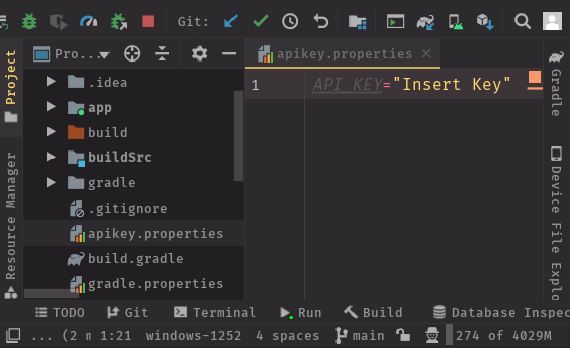

# WMChallenge

This is my solution to the take-home challenge.

### Demo

### Objectives

- [x] Stay as true to the provided design as possible.
- [x] Return businesses based on user's input.
- [x] Each business should include:
  - [x] Image
  - [x] Name
  - [x] Rating
  - [x] Top rated review

### Instructions

Just clone the project and input your Yelp API key in the apikey.properties file located in the root directory.

### Notes

The default location used is Irvine, CA and the default search term is "food".

### Dependencies Added

- Navigation
- Lifecycle
